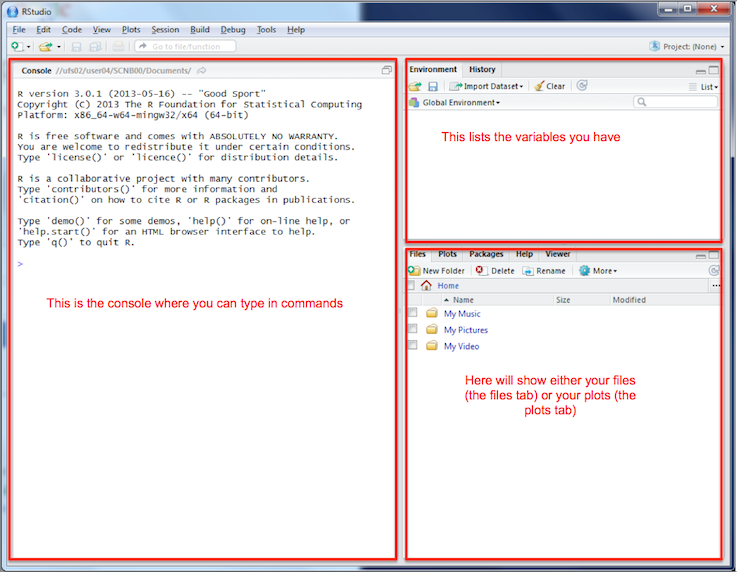
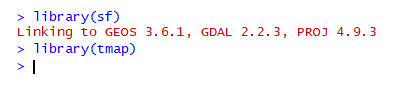
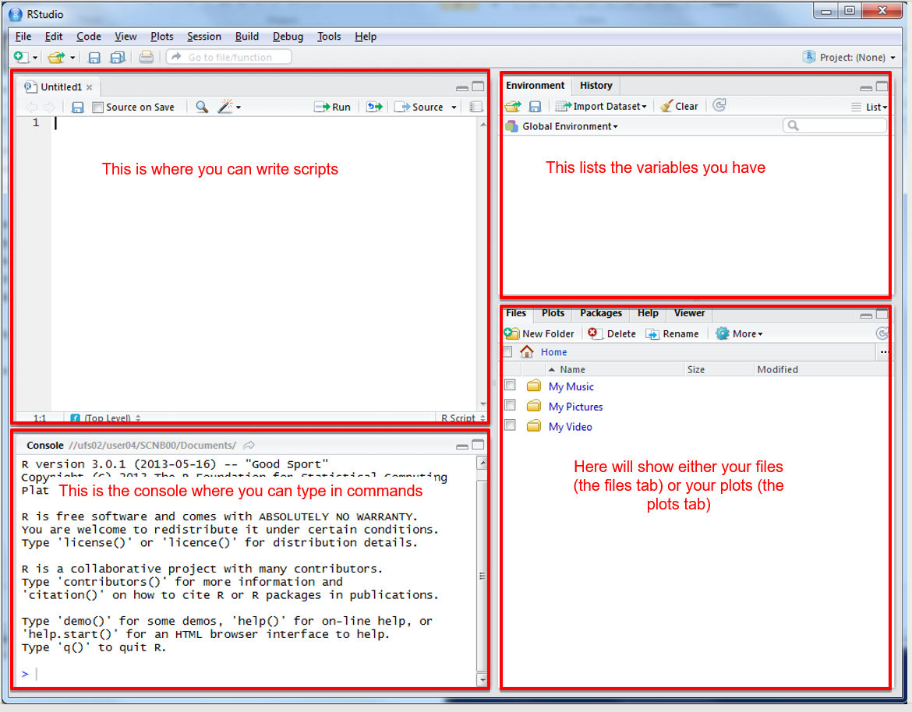

```{r setup, echo=FALSE}
#set working directory to /data-user
knitr::opts_knit$set(root.dir = 'C:/Users/nick/Dropbox/Work/2020-010-CDRC-training/mini-r-course/course-material/data-user')
```

# Welcome

<iframe width="560" height="315" src="https://www.youtube.com/embed/FJJZi4ThIv4" frameborder="0" allow="accelerometer; autoplay; clipboard-write; encrypted-media; gyroscope; picture-in-picture" allowfullscreen></iframe>

This is a quick overview of working with spatial data in R. You can complete it as either a stand alone course, or as a recap before moving on to more advanced work with spatial data in R. 

It is split into three sections, each with a short video clip and a series of commands to work through:  
- [Part 1: What is R & how does it work?](#part1)  
- [Part 2: Mapping spatial data in R](#part2)  
- [Part 3: Working with Loops in R](#part3)  
  
If you are new to R, expect this to take between 1 and 2 hours to work through. It is recommended that you take a break between each part. 

After completing this material, you will:  
- Be able to use R to read in CSV data  
- Be able to use R to read in spatial data  
- Know how to plot spatial data in R  
- Know how to customize colours and classifications  
- Understand how to use loops for multiple maps  

----

<a name="part1"></a>

# Part 1: What is R & how does it work?

<iframe width="560" height="315" src="https://www.youtube.com/embed/XRmLW1Nrdbc" frameborder="0" allow="accelerometer; autoplay; clipboard-write; encrypted-media; gyroscope; picture-in-picture" allowfullscreen></iframe>

### R Basics

R began as a statistics program and is still used as one by many users. We are going to use a program called RStudio, which works on top of R and provides a good user interface. The key areas of the window are highlighted below.

{ width=80% }

----

**How do I install RStudio?**

- [There are instructions to install R and RStudio.](https://github.com/nickbearman/installing-software/blob/master/r-rstudio.md)  Remember you need to install two separate programs: *R* and *RStudio*.  
- If you get stuck, try searching the web for a tutorial [for example](https://www.datacamp.com/community/tutorials/installing-R-windows-mac-ubuntu) or searching Google for the problem you are having.  
- If you get *really* stuck and can't work it out, you can sign up for a free account with [RStudio.cloud](https://Rstudio.cloud). This runs RStudio through your web browser. *Remember on the free version there is a time limit of 15 hours usage per month, so make sure you log out when you finish.*

----

- Open up RStudio (click **Start** and type in `RStudio` or double-click the icon on the desktop). 

R can initially be used as a calculator - enter the following into the left-hand side of the window - the section labelled **Console**:
 
```{r,eval=FALSE}
6 + 8
```

Don't worry about the `[1]` for the moment - just note that R printed out `14` since this is the answer to the sum you typed in.  In these worksheets, sometimes I show the results of what you have typed in.  This is in the format shown below:

```{r, comment=NA}
5 * 4
```
Also note that `*` is the symbol for multiplication here - the last command asked R to perform the calculation '5 times 4'.  Other symbols are `-` for subtraction and `/` for division:
```{r, comment=NA}
12 - 14
6 / 17
```


You can also assign the answers of the calculations to variables and use them in calculations. 
```{r, comment=NA}
price <- 300
```
Here,  the value `300` is stored in the variable `price`.  The `<-` symbol means put the value on the right into the variable on the left, it is typed with a `<` followed by a `-`.  

The variables are shown in the window labelled **Environment**, in the top right. Variables can be used in subsequent calculations.  For example, to apply a 20% discount to this price, you could enter the following:
```{r, comment=NA}
price - price * 0.2 
```

or use intermediate variables:
```{r,tidy=FALSE, comment=NA}
discount <- price * 0.2
price - discount
```

R can also work with lists of numbers,  as well as individual ones. Lists are specified using the `c` function.  Suppose you have a list of house prices  specified in thousands of pounds.  You could store them in a variable called `house.prices` like this:

```{r, comment=NA}
house.prices <- c(120,150,212,99,199,299,159)
house.prices
```
Note that there is no problem with full stops in the middle of variable names.

You can then apply functions to the lists.
```{r, comment=NA}
mean(house.prices)
```

If the house prices are in thousands of pounds, then this tells us that the mean house price is 176,900 GBP.  Note that on your display, the answer may be displayed to more significant digits, so you may have something like `r mean(house.prices)` as the mean value.

There are many different ways that R can store data. Key to know is the data type - either `numeric` or `character` *character is another name for string*. We can see what data type R uses with the `class()` function:

```{r, comment=NA}
class(house.prices)
```


### The Data Frame

R has a way of storing data in an object called a **data frame**. This is rather like an internal spreadsheet where all the relevant data items are stored together as a set of columns. 

We have a CSV file of house prices and burglary rates, which we can load into R. We can use a function called `read.csv` which, as you might guess, reads CSV files. Run the line of code below, which loads the CSV file into a variable called `hp.data`. 

<!-- There are various data files used for this workshop. Ideally I would pull them in directly from GitHub with code, but I can't work out how to do this. A copy of all the data used is in the data sub-directory. Using https://raw.githubusercontent.com/nickbearman/intro-r-spatial-analysis/master/data/hpdata.csv just gives an error message. -->
<!-- Update hp.data <- read.csv("https://raw.githubusercontent.com/nickbearman/intro-r-spatial-analysis/master/data/hpdata.csv") does work but the URL is much longer, which is annoying -->

```{r}
hp.data <- read.csv("http://nickbearman.me.uk/data/r/hpdata.csv")
```

When we read in data, it is always a good idea to check it came in ok. To do this, we can preview the data set. The `head` command shows the first 6 rows of the data.

```{r, comment=NA}
head(hp.data)
```

You can also click on the variable listed in the Environment window, which will show the data in a new tab. You can also enter:

```{r, comment=NA}
View(hp.data)
```
to open a new tab showing the data. 

You can also describe each column in the data set using the `summary` function:
```{r, comment=NA, eval = FALSE}
summary(hp.data)
```
For each column,  a number of values are listed:

Item    | Description
--------|----------------------------------------------------------------------------
Min.    | The smallest value in the column
1st. Qu.| The first quartile (the value 1/4 of the way along a sorted list of values)
Median  | The median (the value 1/2 of the way along a sorted list of values)
Mean    | The average of the column
3rd. Qu.| The third quartile (the value 3/4 of the way along a sorted list of values)
Max.    | The largest value in the column

<!-- Ideally want to add the paragraph below into a 'Notes on Summary Data' box -->
*Based on these numbers, an impression of the spread of values of each variable can be obtained. In particular it is possible to see that the median house price in St. Helens by neighbourhood ranges from 65,000 GBP to 260,000 GBP and that half of the prices lie between 152,500 GBP and 210,000 GBP. Also it can be seen that since the median measured burglary rate is zero, then at least half of areas had no burglaries in the month when counts were compiled.*

We can use square brackets to look at specific sections of the data frame, for example `hp.data[1,]` or `hp.data[,1]`. We can also delete columns and create new columns using the code below. Remember to use the `head()` command as we did earlier to look at the data frame. 

```{r, eval=FALSE}
#create a new column in hp.data dataframe call counciltax, storing the value NA
hp.data$counciltax <- NA
#see what has happened
head(hp.data)

#delete a column
hp.data$counciltax <- NULL
#see what has happened
head(hp.data)
```

```{r, comment = NA}
#rename a column
colnames(hp.data)[3] <- "Price-thousands"
#see what has happened
head(hp.data)
```

### Geographical Information

R has developed into a GIS as a result of user contributed packages, or libraries, as R refers to them. We will be using several libraries in this practical. 

You will need to install the R libraries, as well as loading them. To do this, run `install.packages("sf")` and `install.packages("tmap")`.

We only need to install them once, but we need to load them every time we use them in a new session (remember the light bulb?):

```{r,message=FALSE,display=FALSE, warning = FALSE}
#load libraries
library(sf)
library(tmap)
```

----

**Get an error message?**

R prints some red text - something is is an error message, sometimes this is just information. Read the text before worrying that it is an error. This is what R gave me (you might get something slightly different):



----

However, this just makes R *able* to handle geographical data, it doesn't actually load any specific data sets. To do this, we need to read in some data. We are going to use **shapefiles** - a well known GIS data format. We are going to be using LSOA (Lower layer Super Output Areas) data for St. Helens in Merseyside. 

R uses working folders to store information relevant to the current project you are working on. I suggest you make a folder called **R work** somewhere sensible. Then we need to tell R where this is, so click **Session > Set Working Directory > Choose Directory...** and select the folder that you created. 

<!-- change working directory -->
```{r setwd, include=FALSE}
setwd("C:/Users/nick/Dropbox/Work/course-repos/03-intro-r-spatial-analysis/data-user")
```

There is a set of shapefiles for the St. Helens neighbourhoods at the same location as the data set you read in earlier. Since several files are needed,  I have bundled these together in a single zip file.  You will now download this to your local folder and subsequently unzip it. This can all be done via R functions:
 
 
```{r, comment=NA}
download.file("http://www.nickbearman.me.uk/data/r/sthelens.zip","sthelens.zip")
unzip("sthelens.zip")
```

The first function actually downloads the zip file into your working folder, the second one unzips it. Now, we can read these into R. 

```{r, comment=NA, message=FALSE, results='hide'}
sthelens <- st_read("sthelens.shp")
```
 
The `st_read` function does this and stores them as a Simple Features (or `sf`) object. You can use the `qtm` function to draw the polygons (i.e. the map of the LSOA).
 
```{r, comment=NA}
qtm(sthelens)
```

We can also use the `head()` command to show the first six rows, exactly the same as with a data frame. 

```{r, comment=NA}
head(sthelens)
```

*This is the same as the attribute table in programs like ArcGIS, QGIS or MapInfo. If you want to open the shapefile in QGIS or ArcGIS to have a look, feel free to.*

You can see there is a lot of information there, including the geometry. The useful bit for us is the `ID` field, as this matched the ID field in the `hp.data` file. We can use this to join the two data sets together, and then show the Burglary rates on the map. 

The idea is that there is a field in each data set that we can use to join the two together; in this case we have the `ID` field in `sthelens` and the `ID` field in `hp.data`. 
 
 
```{r, comment=NA}
sthelens <- merge(sthelens, hp.data)
```
 
And use the `head` function to check the data have been joined correctly. 

```{r,comment=NA,eval=FALSE}
head(sthelens)
```
 
Now that we have joined the data together, we can draw a choropleth map of these house prices.  

```{r, comment=NA, eval=FALSE}
#qtm
qtm(sthelens,  fill="Burglary")
```

This is a very quick way of getting a map out of R. To use the map, click on the **Export** button, and then choose **Copy to Clipboard...**. Then choose Copy Plot. If you also have Word up and running, you can then paste the map into your document. You can also save the map as an Image or PDF. 

----

<a name="part2"></a>

# Part 2: Mapping Spatial Data in R

<iframe width="560" height="315" src="https://www.youtube.com/embed/6ogAXqvUEWU" frameborder="0" allow="accelerometer; autoplay; clipboard-write; encrypted-media; gyroscope; picture-in-picture" allowfullscreen></iframe>

Working with R often requires several lines of code to get an output. Rather than typing code into the **Console**, we can use a **script** instead. This allows us to go back and edit the code very easily, to correct mistakes! 

Create a new script (**File > New File > R Script**) and enter the code in there. Then you can select the lines you want to run by highlighting them, and then pressing `Ctrl+Enter`, or using the **Run** button. 

{ width=80% }

Now we are going to use the same principle as we used before to create a map of some data from the 2011 Census. We need to download the data, and although there are other sources of these data, in this example we will use the https://www.nomisweb.co.uk/ website.

- Navigate to https://www.nomisweb.co.uk/. 
- Under **Census Statistics** click **2011 Data catalogue**. 
- Select **Key Statistics (KS)**. 
- Choose **KS102EW - Age Structure**. 
- There are various different ways of downloading the data - explore the different options. We are going to download the table as a CSV file. 
- Under **Download (.csv)** choose **super output areas - lower layer 2011** from the drop down list. 
- Click **Download**. 
- A file called `bulk.csv` will be downloaded - save this in your working directory.  

<!-- Last checked 2020-06-02 -->
  
Open this file up in Excel, and you can see there are a number of different columns, covering different data. We are interested in the age data - scroll across and see the different values we have. 

Add the command below to your script, and run it to read in the CSV file. The `header = TRUE` tells R to assign the first row as variable names. 

```{r, echo=FALSE, comment=NA}
#download csv file
download.file("http://www.nickbearman.me.uk/data/r/nomis-2011-age-data.zip","nomis-2011-age-data.zip")
#unzip csv file
unzip("nomis-2011-age-data.zip")
```

```{r, comment=NA}
pop2011 <- read.csv("bulk.csv", header = TRUE)
```

Then run `head` to see that the data has been read in correctly. *R will show all 23 variables, where as I've only shown the first 5 in the handout*. 

```{r, eval=F}
head(pop2011)
```

```{r, echo=F, comment=NA}
head(pop2011[,1:5])
```

Some of the variable names are not displayed very clearly. We can rename the columns, so that when we run the `head` command, R lists the correct names. This will also help us refer to the columns later on. 

Run the code below, which creates a new variable which contains the names (`newcolnames`) and then applies it to the `pop2011` data frame. 

*It's also worth noting here that any line of code that starts with a `#` is a comment - i.e. R will ignore that line and move onto the next. I've included them here so you can see what is going on, but you don't need to type them in.* 

```{r, comment=NA}
#create a new variable which contains the new variable names
newcolnames <- c("AllUsualResidents","Age00to04","Age05to07",
                 "Age08to09","Age10to14","Age15","Age16to17",
                 "Age18to19","Age20to24","Age25to29",
                 "Age30to44","Age45to59","Age60to64",
                 "Age65to74","Age75to84","Age85to89",
                 "Age90andOver","MeanAge","MedianAge")

#apply these to pop2011 data frame
colnames(pop2011)[5:23] <- newcolnames
```

The final line of code (starting `colnames`) actually updates the variable names. The square brackets are used to refer to specific elements- in this case, columns 5 to 23. *For example, `pop2011[1,]` will show the first row and `pop2011[,1]` will show the first column.*
  
Now we have the correct column names for the data frame. It would also be good to check they have been applied to the `pop2011` dataframe correctly. **What code would you use to do this?**

```{r, echo=F, comment=NA}
head(pop2011[,1:9])
```

Now we have the attribute data (the number of people in each age group in each LSOA in this case) we need to join this attribute data to the spatial data. Therefore, first, we need to download the spatial data. 

- Go to http://census.edina.ac.uk/ and select **Boundary Data Selector**. 
- Then set **Country** to **England**, **Geography** to **Statistical Building Block**, **dates** to **2011 and later**, and click **Find**.
- Select **English Lower Layer Super Output Areas, 2011** and click **List Areas**. 
- Select **Liverpool** from the list and click **Extract Boundary Data**. 
- After a 5 to 20 second wait, click `BoundaryData.zip` to download the files. 

<!-- Last checked 2020-06-02 -->
  
Extract the files, and move all the files starting with the name `england_lsoa_2011` to your working folder. Then read in the data:
  
```{r, echo=FALSE, comment=NA}
download.file("http://www.nickbearman.me.uk/data/r/england_lsoa_2011.zip","england_lsoa_2011.zip")
unzip("england_lsoa_2011.zip")
```

```{r, comment=NA, results='hide'}
#read in shapefile
LSOA <- st_read("england_lsoa_2011.shp")
```

Like earlier, we can use the `qtm()` command to preview the map. We can also look at the attribute table with `head()`. Try these both now. 

The next stage is to join the attribute data to the spatial data, like we did in the exercise earlier. See if you can see how and why I have changed the code from earlier. 

```{r, comment=NA}
#join attribute data to LSOA
LSOA <- merge(LSOA, pop2011, by.x="code", by.y="geography.code")
```

And use the `head` command to check it has joined correctly. Your data should contain correctly labelled Age data in the 7th to 26th columns. 

```{r, eval=F}
head(LSOA)
```

```{r, eval=F,echo=F,comment=NA}
head(LSOA[,1:6])
```

### Making Maps

Now we have all the data setup, we can actually create the map. We can use the `qtm()` code like we did earlier. 

We can use the `fill` parameter like we did earlier with the `Burglary` data. Try working out the code yourself to show the first set of age data. 

{ width=100% }

This works well, and we can choose which variable to show. However we don't get many options with this. We can use a different function `tm_shape()`, which will give us more options. 

```{r echo=TRUE, eval=FALSE}
tm_shape(LSOA) +
  tm_polygons("Age00to04")
```

```{r echo=TRUE, eval=FALSE}
tm_shape(LSOA) +
  tm_polygons("Age00to04", title = "Aged 0 to 4", palette = "Greens", style = "jenks") +
  tm_layout(legend.title.size = 0.8)
```

This allows us to change the title, colours and legend title size. Try substituting in `Blues` and adjusting the title. 

### Colours and Categories 

We can choose lots of different colours from ColorBrewer, and different classification methods as well. To show all of the different colour palettes we could use, run this code:

```{r echo=TRUE, eval=FALSE}
#load the R Color Brewer library
  library(RColorBrewer)
#display the palette
  display.brewer.all()
```

We can also choose which classification method to use and how many classes. We can set `n = 6` to set the number of classes

```{r echo=TRUE}
tm_shape(LSOA) +
  tm_polygons("Age00to04", title = "Aged 0 to 4", palette = "Greens", n = 6, style = "jenks")
```

We can also set the `style` which is the classification method. Standard options are: 

| **Classification Name** | **Code**   | **Details or Example** |  
| ----                    | ----       | ----                   | 
| Equal Interval          | `equal`    | *Regular intervals e.g. 0-5, 5-10, 10-15, 15-20* | 
| Quantiles               | `quantile` | *Split the data into 5 equal categories, with the same                                            number of data points in each category* | 
| Natural Breaks          | `jenks`    | *Algorithm based to create data driven categories* | 
| Standard Deviation      | `sd`       | *Bases classes on data's standard deviation e.g. -2SD to -1SD, -1SD to 0, 0 to 1SD, 1SD to 2SD* | 
| Fixed Breaks            | `fixed`    | *You choose the breaks - see below* | 

**Fixed Breaks example:**

```{r echo=TRUE}
tm_shape(LSOA) +
  tm_polygons("Age00to04", title = "Aged 0 to 4", palette = "Greens", n = 6, style = "fixed",
    breaks=c(6, 25, 50, 75, 100, 244))
```

### Classification on a Histogram (optional exercise)

You can also show a histogram with the classification breaks using this code:

```{r, eval=FALSE}
#select the variable
  var <- LSOA$Age00to04
#calculate the breaks
  library(classInt)
  breaks <- classIntervals(var, n = 6, style = "fisher")
#draw histogram
  hist(var)
#add breaks to histogram
  abline(v = breaks$brks, col = "red")
```

### Histograms

We can also add a histogram of the data to the map:

```{r,eval=FALSE}
tm_shape(LSOA) +
  tm_polygons("AllUsualResidents", title = "All Usual Residents", palette = "Greens", 
      style = "equal", legend.hist = T)
```

### Layout Options and Margins (optional exercise)

`tmap` has a huge number of options to customise the layout - have a look at https://rdrr.io/cran/tmap/man/tm_layout.html. 

You may often have to adjust the margins to make your map look good. Adjusting the `inner.margins` is a good starting point. It is a vector (list) of four values specifying the bottom, left, top, and right margins, in that order. For example:

```{r,eval=FALSE}
tm_shape(LSOA) +
  tm_polygons("Age00to04", title = "Aged 0 to 4", palette = "Greens", style = "jenks") +
  tm_layout(legend.title.size = 0.8, inner.margins = c(.04, .03, .02, .01))
```

### Scale Bar and North Arrow (optional exercise)

It is also good practice to add a scale bar and a north arrow to each of the maps you produce. Running this code will add these to the map:

```{r, eval=FALSE}
tm_shape(LSOA) +
  #Set colours and classification methods
  tm_polygons("AllUsualResidents", title = "All Usual Residents", palette = "Greens", 
      style = "equal") +
  #Add scale bar
  tm_scale_bar(width = 0.22, position = c(0.05, 0.18)) +
  #Add compass
  tm_compass(position = c(0.3, 0.07)) + 
  #Set layout details
  tm_layout(frame = F, title = "Liverpool", title.size = 2, 
            title.position = c(0.7, "top"))
```

You may well need to adjust the position of the items on the map. Try Googling `"tm_scale_bar position"` for information on how to do this. 

Remember that any line starting with a `#` is a comment, and will be ignored by R. Comments are very useful for us to note what the code is doing, particularly when you come back to it 6 months later and can't remember what it is supposed to do!

### Interactive Maps (optional exercise)

The `tmap` library has two different viewing options - `plot` which is what we have been using so far, and `view` which provides a basemap and the ability to zoom in and out. Try this code:

```{r, comment=NA, eval=FALSE}
#set tmap to view mode
  tmap_mode("view")
#plot using qtm
  qtm(sthelens)
#plot using tm_shape
  tm_shape(LSOA) +
  #Set colours and classification methods
  tm_polygons("AllUsualResidents", title = "All Usual Residents", palette = "Greens", 
      style = "equal")
#return tmap to plot mode
  tmap_mode("plot")
```

*Shiny is a tool developed by RStudio we can use to create interactive maps on the web, with many different options. Have a look at https://shiny.rstudio.com/.*

----

<a name="part3"></a>

# Part 3: Working with Loops in R

<iframe width="560" height="315" src="https://www.youtube.com/embed/jgoxxfZ8eLU" frameborder="0" allow="accelerometer; autoplay; clipboard-write; encrypted-media; gyroscope; picture-in-picture" allowfullscreen></iframe>

### Exporting and Creating Multiple Maps

We can automatically save the map as a file by creating the map object as a new variable (`m`) and then save it using `tmap_save(m)`. 

```{r, comment=NA, eval=FALSE}
#create map
m <- tm_shape(LSOA) +
  tm_polygons("AllUsualResidents", title = "All Usual Residents", palette = "Greens", 
              style = "equal") +
  tm_scale_bar(width = 0.22, position = c(0.05, 0.18)) +
  tm_compass(position = c(0.3, 0.07)) + 
  tm_layout(frame = F, title = "Liverpool", title.size = 2, 
            title.position = c(0.7, "top"))
#save map
tmap_save(m)
```

Saving the map using code allows us to create multiple maps very easily. A variable (`mapvariables`) is used to list which variables should be mapped, and then the line starting `for` starts a loop. Try running the code, and then change the variables it maps.
 
  
```{r message=FALSE, warning=FALSE, comment=NA}
#set which variables will be mapped
  mapvariables <- c("AllUsualResidents", "Age00to04", "Age05to07")

#loop through for each map
  for (i in 1:length(mapvariables)) {
  #setup map
    m <- tm_shape(LSOA) +
      #set variable, colours and classes
      tm_polygons(mapvariables[i], palette = "Greens", style = "equal") +
      #set scale bar
      tm_scale_bar(width = 0.22, position = c(0.05, 0.18)) +
      #set compass
      tm_compass(position = c(0.3, 0.07)) + 
      #set layout
      tm_layout(frame = F, title = "Liverpool", title.size = 2, 
                title.position = c(0.7, "top"))
    #save map
    tmap_save(m, filename = paste0("map-",mapvariables[i],".png"))
  #end loop
  }
```

You can replace `.png` with `.jpg` or `.pdf` for different file formats. 


----

Try experimenting with the code you have created. You can't break anything!

----

## Wrap-up

<iframe width="560" height="315" src="https://www.youtube.com/embed/uhmRjBJnMYo" frameborder="0" allow="accelerometer; autoplay; clipboard-write; encrypted-media; gyroscope; picture-in-picture" allowfullscreen></iframe>

----

This practical was written using R 3.5.1 (2018-07-02) and RStudio 1.1.463, and tested on R 4.0.2 (2020-06-22) and RStudio Cloud (RStudio Server Pro Version 1.3.1056-1) by Dr. Nick Bearman (nick@geospatialtrainingsolutions.co.uk). 

This work is licensed under the Attribution-NonCommercial-ShareAlike 4.0 International License. To view a copy of this license, visit http://creativecommons.org/licenses/by-nc-sa/4.0/. The latest version of the workbook is available from https://github.com/nickbearman/short-course-r-gis. This version was created on `r format(Sys.time(), '%d %B %Y')`. 

